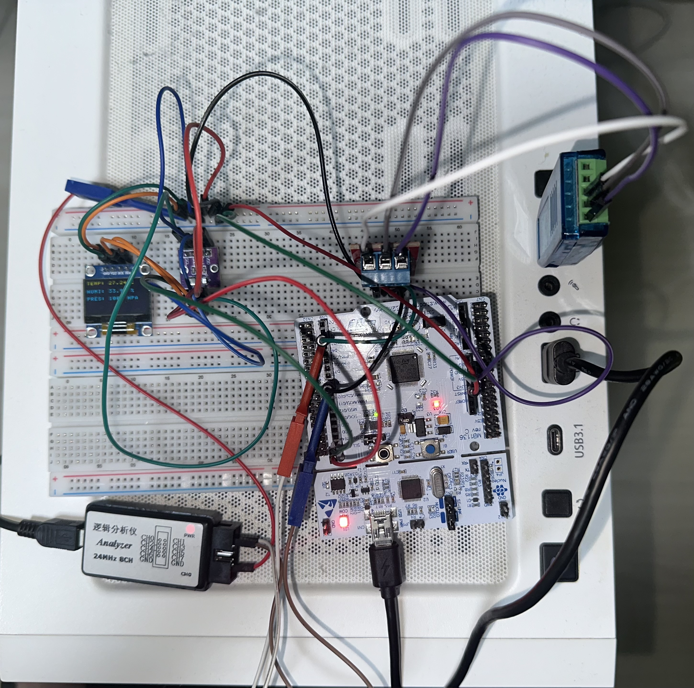
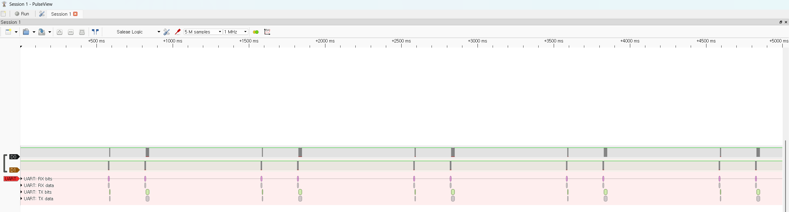
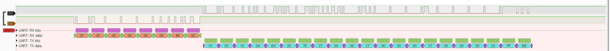
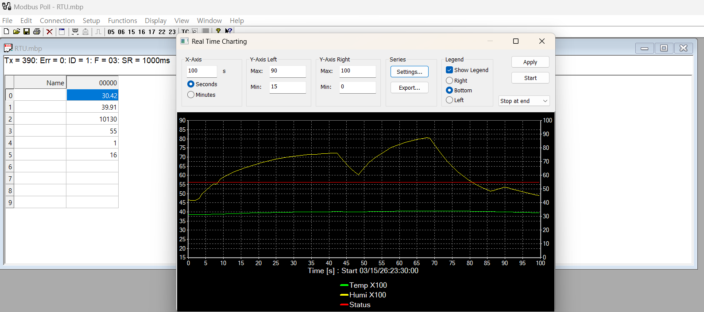

# STM32F411RE Environmental Monitoring System

STM32F411RE (NUCLEO-F411RE) 기반 환경 모니터링 펌웨어 프로젝트입니다.  
BMP280(온도/기압), AHT20(습도), SSD1306 OLED, UART CLI를 사용해 센서 데이터를 수집하고 표시하며, 현재 동작 상태를 확인할 수 있도록 구성했습니다.

이 프로젝트의 핵심은 센서 측정 경로를 `HAL_Delay()` 기반 순차 처리에서 `HAL_GetTick()` 기반 non-blocking 상태머신으로 재구성한 점입니다.  
각 센서는 독립적인 task로 동작하며, 주기적 trigger, status polling, timeout 처리를 통해 super-loop 구조에서도 다른 기능과 병행 실행될 수 있도록 설계했습니다.

또한 raw sensor value와 사용자 표시용 값을 분리하고, `env_data` 레이어에서 반올림, 음수 처리, clamp, fixed-point 변환을 담당하도록 구성했습니다.  
UART CLI를 통해 측정값, 센서 상태, 디버그 정보, 주기 보고 기능을 확인할 수 있으며, OLED에는 최신 환경 정보를 주기적으로 표시합니다.

추가로, 외부 장치가 표준 산업용 프로토콜로 센서 데이터를 읽을 수 있도록 **Modbus RTU Slave 통신**을 확장했고, **RS485 실통신**까지 검증했습니다.

이 문서는 프로젝트의 구조, 설계 의도, 상태머신 동작, 빌드 환경, 주요 명령어를 정리한 기술 문서입니다.

## Documentation

- [Architecture Diagram](docs/architecture.md)
- [Sensor State Machines](docs/state_machines.md)

## Table of Contents

- [Project Highlights](#project-highlights)
- [Design Goals](#design-goals)
- [Hardware](#hardware)
- [System Overview](#system-overview)
- [Main Loop](#main-loop)
- [Software Architecture](#software-architecture)
- [Architecture Diagram](#architecture-diagram)
- [Sensor Design](#sensor-design)
- [BMP280](#bmp280)
- [AHT20](#aht20)
- [Data Layer (`env_data`)](#data-layer-env_data)
- [UART CLI](#uart-cli)
- [LED Control](#led-control)
- [Boot Sequence](#boot-sequence)
- [Design Decisions](#design-decisions)
- [Example UART Output](#example-uart-output)
- [Modbus RTU / RS485](#modbus-rtu--rs485)
- [Why USART1 was used](#why-usart1-was-used)
- [Current Modbus Scope](#current-modbus-scope)
- [Holding Register Map](#holding-register-map)
- [Notes on Data Representation](#notes-on-data-representation)
- [Verification](#verification)
- [Design Takeaway](#design-takeaway)
- [Current Limitations](#current-limitations)
- [Future Work](#future-work)

## Project Highlights

- STM32F411RE 기반 환경 모니터링 시스템(BMP280 / AHT20 / SSD1306)
- `HAL_Delay()`를 메인 측정 경로에서 제거하고, `HAL_GetTick()` 기반 non-blocking state machine으로 센서 측정을 비동기화
- UART CLI(`cmd_table`)로 `ENV`, `DEBUG`, `REPORT`, `SENSSTAT` 등 운영/디버깅 기능 제공
- 센서 Task는 1초 주기로 측정을 시작하고, OLED 갱신 및 auto report는 10초 주기로 수행
- 측정 완료 판정은 고정 delay 대신 센서 status bit polling으로 처리하고, polling throttle 및 software timeout을 함께 적용
- 환경 값과 raw ADC 데이터는 `env_data` 레이어로 통합하고, 반올림 / 음수 부호 / 클램핑 등 표현 로직을 별도 분리
- I2C error count를 노출해 센서 통신 이상 여부를 런타임에 확인 가능
- **Modbus RTU (0x03 Read Holding Registers)** 를 **RS485** 위에 구현했고, **USART1 (PA9/PA10)** 을 사용해 Modbus Poll과의 실통신을 검증

## Design Goals

본 프로젝트는 다음과 같은 설계 목표를 기준으로 구성했습니다.

- Delay 기반 센서 측정 흐름을 **non-blocking 상태머신(State Machine)** 구조로 전환
- 다중 페리퍼럴 동작 상황에서도 super-loop의 응답성 유지
- 센서 raw 데이터 수집부와 사용자 표시용 데이터 가공부(formatting)의 분리
- UART CLI를 통한 런타임 상태 확인 및 디버깅 가능성 확보
- 센서 대기 상태와 I2C 통신 오류에 대한 명시적 timeout / fault handling 적용

## Hardware

- MCU: STM32F411RE (NUCLEO-F411RE)
- Sensor 1: BMP280 (Temperature / Pressure)
- Sensor 2: AHT20 (Humidity)
- Display: SSD1306 OLED
- Timing / PWM: TIM2
- Bus: I2C1 (100 kHz)
- Communication:
  - USART1 (PA9/PA10) for Modbus RTU / RS485
  - UART CLI / debug path used during bring-up
- External interface:
  - TTL-to-RS485 transceiver
  - USB-to-RS485 adapter
  - Modbus Poll for validation

*STM32F411RE, BMP280, AHT20, SSD1306 OLED, TTL-to-RS485 transceiver, USB-to-RS485 adapter, logic analyzer를 함께 연결한 실통신 검증용 프로토타입 셋업입니다.*

## System Overview

부팅 후 시스템은 UART 수신 인터럽트, TIM2 PWM, I2C1을 초기화하고 I2C bus scan을 수행한 뒤 OLED와 센서를 초기화합니다. 이후 main loop에서는 두 센서 Task를 매 루프 호출하고, 드라이버 내부 최신 측정값을 `g_temp`, `g_humi`, `g_press` 및 raw 데이터 전역값으로 반영합니다. LED 자동 제어는 최신 습도값을 사용하고, OLED 표시 및 UART auto report는 10초 주기로만 수행됩니다. UART 명령 처리는 루프 말단에서 수행되며, Modbus RTU 모드에서는 holding register 요청을 파싱하고 응답 프레임을 생성합니다.

## Main Loop

~~~c
while (1)
{
    BMP280_Task();
    AHT20_Task();

    BMP280_Get_Data(&g_temp, &g_press);
    AHT20_Get_Data(NULL, &g_humi);

    BMP280_Get_RawAdc(&g_raw_adc_T, &g_raw_adc_P);
    g_raw_humi = AHT20_Get_RawHumi();

    LED_Auto_Control(g_humi);

    if (HAL_GetTick() - report_tick >= 10000)
    {
        report_tick = HAL_GetTick();
        // OLED update + optional auto report
    }

    // UART CLI or Modbus RTU processing
}
~~~

## Software Architecture

프로젝트는 기능별 모듈 분리를 기준으로 구성했습니다.

- `main.c`
  - 시스템 초기화
  - super-loop orchestration
  - 센서 task 호출
  - 데이터 반영
  - OLED / LED / UART / Modbus 연동
- `bmp280.c`
  - BMP280 초기화
  - 보정계수 처리
  - forced mode trigger
  - status polling / timeout / compensation
- `aht20.c`
  - AHT20 초기화
  - busy bit polling
  - humidity raw 데이터 조립
  - timeout 처리
- `env_data.c`
  - 사용자 표시용 값 가공
  - 반올림 / clamp / 부호 처리
  - fixed-point 변환
- `uart_cmd.c`
  - CLI 명령 파싱
  - 상태 조회 / 디버깅 / 제어 명령
- `led_control.c`
  - normal / blink / breath 출력
  - 자동 LED 동작
- `modbus_rtu.c`
  - Modbus RTU frame parsing
  - CRC16 계산
  - holding register map 조회
  - exception / normal response 생성

## Architecture Diagram

상세 구조는 아래 문서를 참고하세요.

- [Architecture Diagram](docs/architecture.md)

## Sensor Design

센서 측정은 `HAL_Delay()` 기반 blocking 구조 대신, `HAL_GetTick()` 기반 non-blocking 상태머신으로 설계했습니다.  
각 센서는 독립적인 task 함수로 주기적으로 호출되며, 내부 상태에 따라 trigger, polling, timeout, data-ready 판정을 수행합니다.

## BMP280

BMP280은 다음 흐름으로 동작합니다.

- `IDLE`
- `MEASURING`
- `DATA_READY`

forced mode를 trigger한 뒤, status register의 measuring bit를 polling하여 측정 완료를 판정합니다.  
고정 delay를 사용하지 않고 polling throttle과 timeout을 함께 두어, super-loop 응답성을 유지하면서도 비정상 대기 상태를 방지했습니다.

## AHT20

AHT20은 다음 흐름으로 동작합니다.

- `IDLE`
- `MEASURING`

측정 명령 전송 후 busy bit를 polling하여 완료를 판정합니다.  
이 과정에서도 polling throttle과 timeout을 적용해 센서 task가 루프를 과도하게 점유하지 않도록 했습니다.

## Data Layer (`env_data`)

`env_data` 레이어는 내부 raw sensor value와 사용자 표시용 값을 분리하는 역할을 담당합니다.

주요 책임은 다음과 같습니다.

- 반올림
- 음수 부호 처리
- clamp
- fixed-point 변환
- 표시용 format 정리

이를 통해 센서 드라이버는 “측정과 보정”에 집중하고, 표시/UI/통신 계층은 가공된 값을 일관되게 사용할 수 있도록 했습니다.

## UART CLI

CLI는 사람이 읽기 쉬운 형태로 현재 시스템 상태를 확인하고, 센서/LED 동작을 제어하기 위한 디버깅 인터페이스입니다.

예시 명령:

- `ENV`
- `DEBUG`
- `REPORT`
- `SENSSTAT`
- `LED`
- `INTERVAL`
- `BRIGHT`
- `BREATH`
- `BLINK`
- `BREATHSPEED`
- `RESET`
- `TIMER`

## LED Control

LED 제어는 TIM2 PWM을 기반으로 동작하며, 다음 모드를 지원합니다.

- normal
- blink
- breath

또한 최신 습도값을 기준으로 자동 제어 로직을 적용해, 센서값 변화에 따라 LED 동작이 바뀌도록 구성했습니다.

## Boot Sequence

부팅 시 시스템은 다음 순서로 초기화됩니다.

1. HAL / Clock 초기화
2. GPIO / UART / TIM / I2C 초기화
3. I2C bus scan
4. OLED 초기화
5. BMP280 / AHT20 초기화
6. super-loop 진입

## Design Decisions

이 프로젝트에서 중요하게 본 설계 선택은 다음과 같습니다.

- `HAL_Delay()` 제거를 통한 non-blocking 구조 전환
- 센서별 독립 상태머신 적용
- polling throttle + timeout 조합
- raw data / display data 분리
- CLI 기반 런타임 진단 가능성 확보
- error count를 통해 통신 문제를 외부에서 확인 가능하도록 구성
- Modbus register는 float 대신 fixed-point 정수 형식으로 제공

## Example UART Output

CLI를 통해 환경값, 디버그 정보, 센서 상태를 텍스트 기반으로 확인할 수 있습니다.

~~~text
> ENV
Temperature : 27.11 C
Humidity    : 56.42 %
Pressure    : 1013 hPa

> SENSSTAT
BMP280 state : DATA_READY
AHT20 state  : MEASURING
BMP err cnt  : 0
AHT err cnt  : 0
~~~

## Modbus RTU / RS485

이 프로젝트는 센서 데이터를 로컬 OLED/CLI 출력에만 사용하는 데서 끝나지 않고,  
산업 현장에서 널리 사용되는 **Modbus RTU** 프로토콜과 **RS485** 물리 계층을 적용해  
외부 Master 장치가 데이터를 읽을 수 있도록 확장했습니다.

현재는 **Slave ID 1** 기준의 **`0x03 Read Holding Registers`** 기능만 우선 구현했으며,  
STM32F411RE가 Modbus RTU Slave로 동작하도록 구성했습니다.

### Why USART1 was used

NUCLEO-F411RE 보드에서 **USART2(PA2/PA3)** 는 기본적으로 **ST-LINK VCP** 경로와 연결되어 있어,  
외부 RS485 모듈과 실통신 경로로 사용하기에 불편했습니다.

실제 실통신 검증은 다음과 같이 진행했습니다.

- **USART1**
  - TX: `PA9`
  - RX: `PA10`
- Board header 기준:
  - `D8 = PA9 = USART1_TX`
  - `D2 = PA10 = USART1_RX`

이를 통해 TTL-to-RS485 모듈과 직접 연결하고,  
USB-to-RS485 어댑터 + Modbus Poll 조합으로 실제 request / response를 검증했습니다.

### Current Modbus Scope

현재 구현 범위는 다음과 같습니다.

- Modbus RTU Slave
- Supported function code:
  - **`0x03 Read Holding Registers`**
- Holding register map 기반 데이터 응답
- 기본 예외 응답 지원
  - Illegal Function
  - Illegal Data Address
  - Illegal Data Value

### Holding Register Map

| Address | Name | Description | Encoding |
|---------|------|-------------|----------|
| `0x0000` | `TEMP_X100` | Temperature | `°C x100` |
| `0x0001` | `HUMI_X100` | Humidity | `%RH x100` |
| `0x0002` | `PRESS_HPA_X10` | Pressure | `hPa x10` |
| `0x0003` | `STATUS_FLAGS` | Status / valid / error bits | bit field |
| `0x0004` | `BMP280_ERR_COUNT` | BMP280 error count | unsigned |
| `0x0005` | `AHT20_ERR_COUNT` | AHT20 error count | unsigned |
| `0x0006` | `RESERVED0` | Reserved for future use | - |
| `0x0007` | `RESERVED1` | Reserved for future use | - |

Status Flags의 valid 비트는 초기화 시 기본적으로 set되지 않으며,  
각 센서 데이터가 실제로 한 번 이상 정상 측정된 이후에만 set되도록 구성했습니다.  
이를 통해 전원 인가 직후의 미측정 상태와 정상 측정 완료 후의 동작 상태를 구분할 수 있도록 했습니다.

### Notes on Data Representation

Modbus register 인터페이스를 단순하고 예측 가능하게 유지하기 위해,  
내부 센서값은 register에 올릴 때 **fixed-point 정수값**으로 변환했습니다.

예를 들면:

- Temperature: `25.34°C` → `2534`
- Humidity: `48.91%` → `4891`
- Pressure: `1013.2 hPa` → `10132` 대신 register 폭과 표현 단위를 고려해 `hPa x10` 사용

이 방식의 장점은 다음과 같습니다.

- `16-bit holding register`에 바로 매핑 가능
- CLI / OLED / Modbus 인터페이스에서 표현 방식 일관성 유지
- float 값을 외부로 직접 노출할 때 발생할 수 있는 애매한 표현 문제 감소

### Verification

구현된 Modbus RTU Slave는 **실물 하드웨어 셋업**, **logic analyzer 기반 UART 파형 계측**,  
그리고 **Modbus Poll**을 함께 사용해 검증했습니다.

- Slave ID: `1`
- Mode: `RTU`
- Function: `03 Read Holding Registers`
- UART: `USART1`
- Physical layer: `TTL-to-RS485 transceiver + USB-RS485 adapter`

#### 1. 주기 동작 검증 (Periodic Communication Check)
Logic analyzer를 이용해 1000 ms 주기로 master request와 slave response가 반복적으로 발생하는 것을 확인한 화면입니다. 이를 통해 연속 동작 중에도 request / response 흐름이 주기적으로 수행되는지 확인했습니다.

#### 2. 프레임 상세 검증 (Frame-Level UART Decode)
단일 transaction을 확대하여 UART raw byte 기준으로 request 프레임과 response 프레임을 직접 확인한 화면입니다. 0x03 Read Holding Registers 요청에 대해 slave address, function code, data field, CRC 바이트 구성을 바이트 단위로 검토했습니다.

#### 3. Master 툴 연동 검증 (Master-Side Register Verification)
Modbus Poll을 이용해 holding register를 주기적으로 읽고, 온도(x100), 습도(x100), 상태값을 실시간으로 확인한 화면입니다.

이 검증 과정을 통해 단순히 Modbus Poll에서 값이 읽히는 것만 확인한 것이 아니라, 실제 하드웨어 셋업, UART request / response 파형, register 응답 구조까지 종합적으로 점검했습니다.

### Design Takeaway

이번 Modbus RTU / RS485 확장을 통해 단순 센서 모니터링 프로젝트를 넘어,  
**외부 장치와 연동 가능한 통신형 임베디드 시스템**으로 확장할 수 있었습니다.

특히 다음과 같은 점을 직접 경험할 수 있었습니다.

- bare-metal 기반 상태머신 구조와 통신 기능의 공존
- 센서 데이터와 통신용 register map 설계
- Modbus frame parsing / response building
- RS485 실통신 디버깅
  - USART 포트 선택
  - IRQ / NVIC 설정
  - A/B 라인 점검
  - Master 툴과의 상호 검증

이는 단순히 센서값을 읽어오는 수준을 넘어서,  
실제 산업 현장에서 자주 사용되는 통신 구조를 직접 구현하고 검증해 본 경험이라는 점에서 의미가 있습니다.

### Current Limitations

현재 구현은 다음 범위에 제한되어 있습니다.

- Function code는 **`0x03 Read Holding Registers`**만 지원
- 다중 slave 구성 미지원
- frame timeout / ring buffer 기반 일반화 미적용
- 고급 예외 상황 테스트는 최소 범위만 수행

### Future Work

향후에는 다음과 같은 확장을 고려할 수 있습니다.

- 추가 function code 지원
  - `0x06 Write Single Register`
  - `0x10 Write Multiple Registers`
- register map 확장
- RTC 기반 timestamp 연동
- external flash logging 연계
- frame timeout / ring buffer 구조 개선