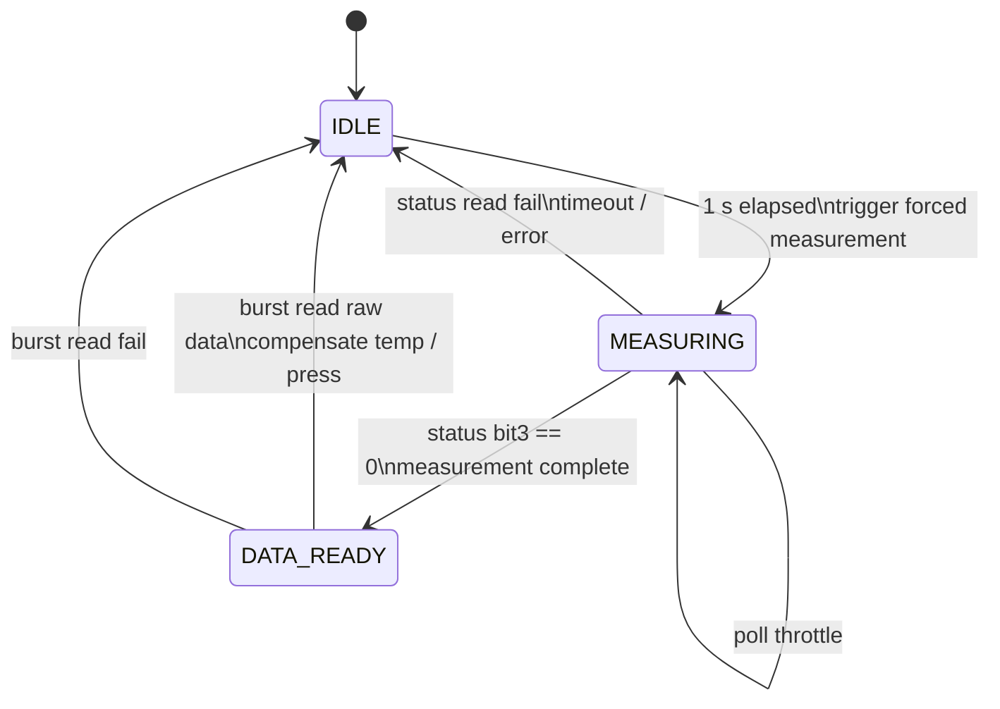
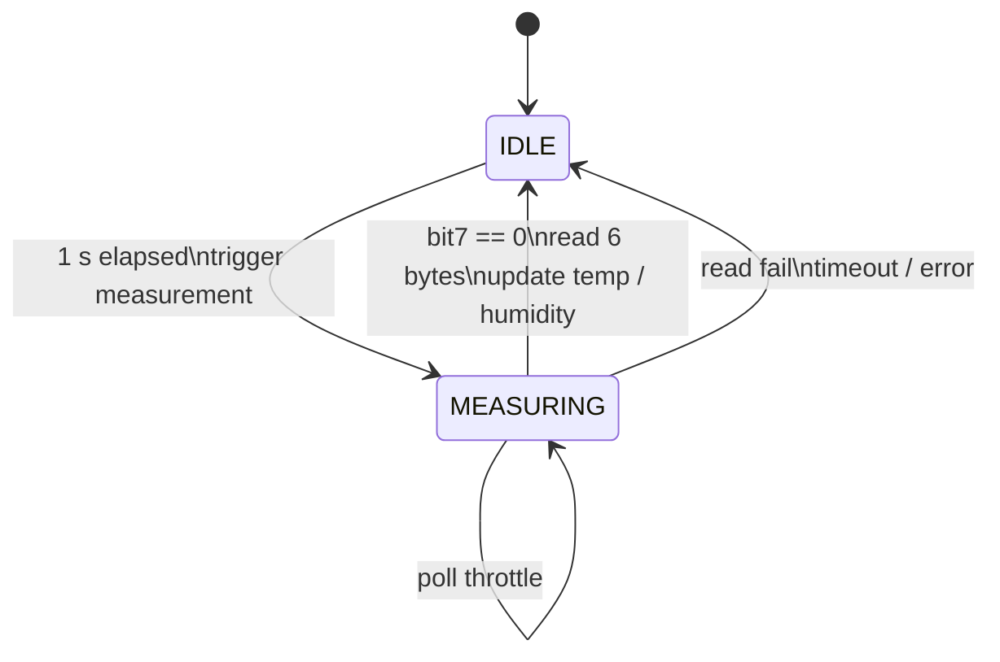

## BMP280

status read가 실패하거나 측정이 200 ms 이내에 완료되지 않으면 task는 `IDLE`로 복귀하고 `error_count`를 증가시킵니다.  
burst read가 성공하면 최신 pressure 및 temperature 데이터를 갱신하고, 해당 유효 플래그도 함께 set합니다.

## AHT20

busy bit가 해제되면 task는 센서에서 6바이트를 읽고 raw humidity 및 temperature 값을 조립한 뒤 최신 데이터를 갱신합니다.  
read가 실패하거나 측정이 200 ms 이내에 완료되지 않으면 task는 `IDLE`로 복귀하고 `error_count`를 증가시킵니다.  
humidity 데이터가 정상적으로 갱신되면 해당 valid flag도 함께 set합니다.