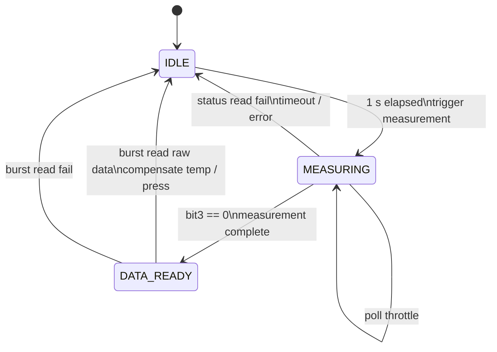

## BMP280


If the status read fails or the measurement does not complete within 200 ms, the task returns to `IDLE` and increments `error_count`.


## AHT20

```mermaid
stateDiagram-v2
    [*] --> IDLE

    IDLE --> MEASURING: 1 s elapsed\ntrigger measurement
    MEASURING --> MEASURING: poll throttle
    MEASURING --> IDLE: bit7 == 0/update humidity
    MEASURING --> IDLE: read fail/timeout
