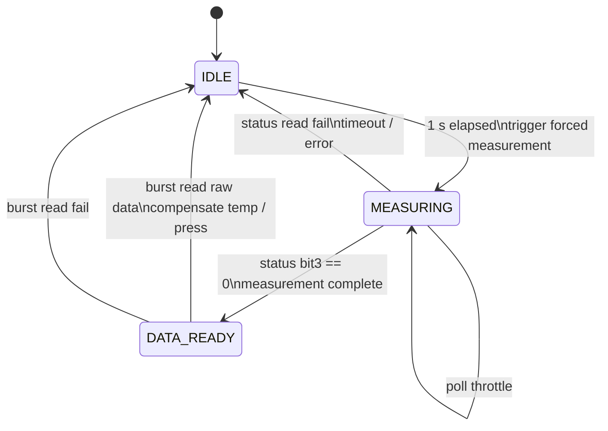
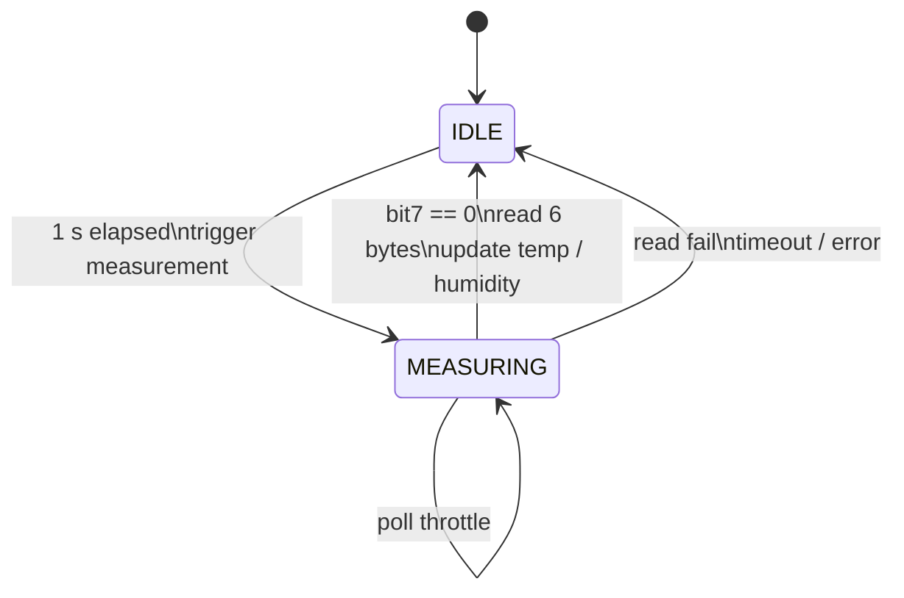

## BMP280

If the status read fails or the measurement does not complete within 200 ms, the task returns to `IDLE` and increments `error_count`.
When the burst read succeeds, the task updates the latest temperature and pressure data and sets the corresponding valid flags.

## AHT20

When the busy bit is cleared, the task reads 6 bytes from the sensor, assembles the raw humidity and temperature values, and updates the latest data.
If the read fails or the measurement does not complete within 200 ms, the task returns to `IDLE` and increments `error_count`.
When humidity data is updated successfully, the corresponding valid flag is also set.